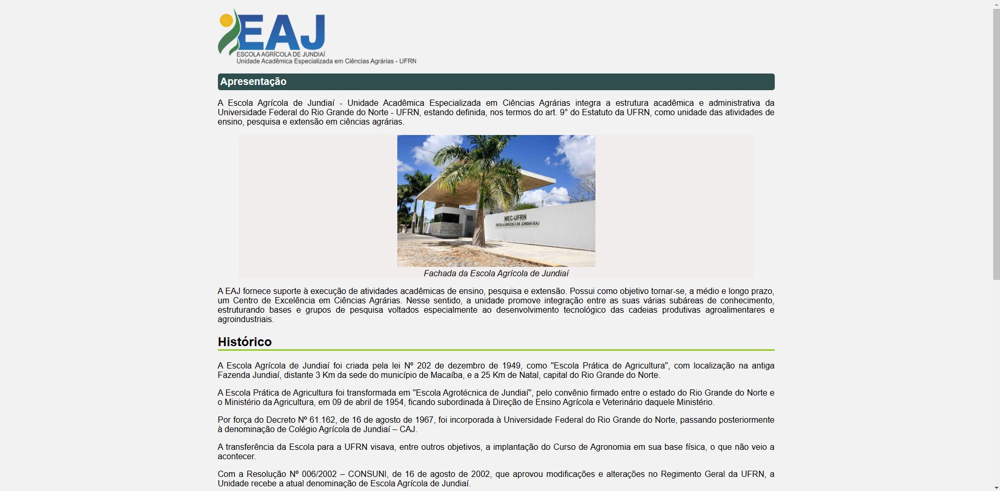

# Mobile First Application Activity

This project demonstrates the application of the Mobile First approach in web development.

## Overview

The Mobile First approach prioritizes designing and developing for mobile devices first, then progressively enhancing the experience for larger screens. This ensures a responsive and user-friendly experience across a wide range of devices.

### Mobile View

### Desktop View

## Project Structure

*   `index.html`: The main HTML file containing the structure of the web page.
*   `assets/css/style.css`: The CSS file containing the styles for the web page, implemented using the Mobile First approach.
*   `assets/img/`: Directory containing images used in the project.
*   `readme.md`: This file, providing an overview of the project.

## Key Concepts Demonstrated

*   **Responsive Design:** Creating a layout that adapts to different screen sizes.
*   **Media Queries:** Using CSS media queries to apply different styles based on device characteristics.
*   **Prioritization of Content:** Ensuring essential content is accessible and well-presented on smaller screens.
*   **Performance Optimization:** Optimizing assets and code for faster loading times on mobile devices.

## How to Run the Project

1.  Clone the repository: `git clone [repository URL]`
2.  Open `index.html` in your web browser.

## Notes

This project serves as a practical example of implementing Mobile First design principles.  Feel free to experiment and modify the code to further explore responsive web development techniques.